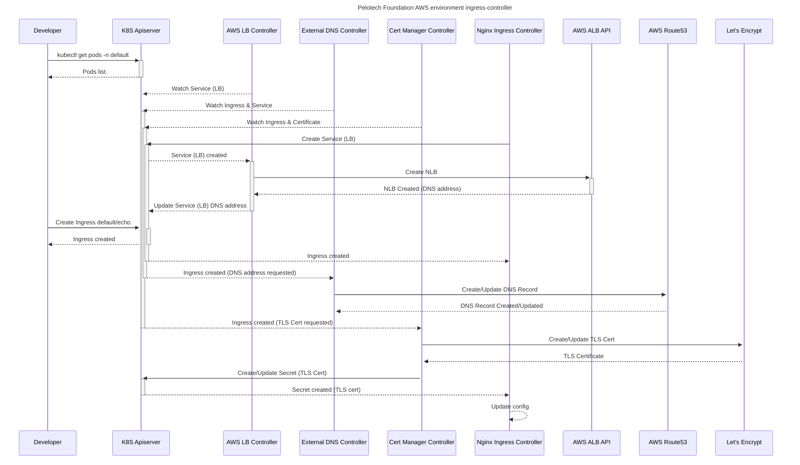

# Cluster Ingress controller

This directory defines a configuration to provide Ingress support on the
cluster. This configuration is specific to an AWS environment where TLS
termination is handled by Nginx on the cluster (as opposed to terminating TLS
via AWS ALB). In this scenario there are two "phases", first to allow traffic
into the cluster (to Nginx), and second how to configure Nginx for dispatch to
on-cluster services.

The first phase entails using the AWS Load Balancer Controller to provision a
Layer 4 load balancer (AWS NLB) for traffic into the cluster from outside.
The second phase entails the Nginx Ingress Controller dynamically configuring
the Layer 7 load balancer (Nginx) via Kubernetes `Ingress` objects.

## AWS Load Balancer Controller

Used to provision an AWS NLB (Layer 4) load balancer to receive traffic
externally and to terminate TLS with Nginx on the cluster (via the Nginx
Ingress Controller).

## Nginx Ingress Controller

Used to service Ingress objects created on the cluster. The combination of
`external-dns`, `cert-manager`, and `nginx-ingress` together provide DNS, TLS,
and HTTP(S) load balancing for Ingress objects.

### Sequence/interaction diagram

