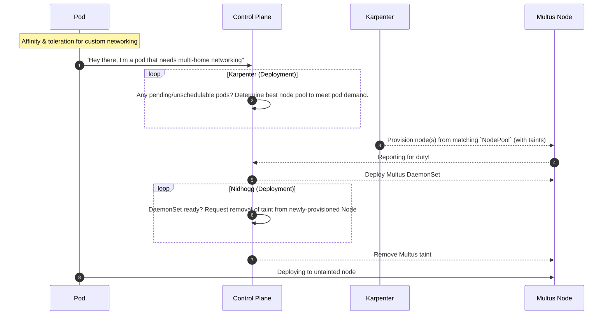

# Multus

A CNI meta-plugin for multi-homed pods in Kubernetes

## Overview

## Resources

- [k8snetworkplumbingwg/multus-cni](https://github.com/k8snetworkplumbingwg/multus-cni)
- [includes `uswitch/nidhogg` to manage node taints](https://github.com/uswitch/nidhogg)
